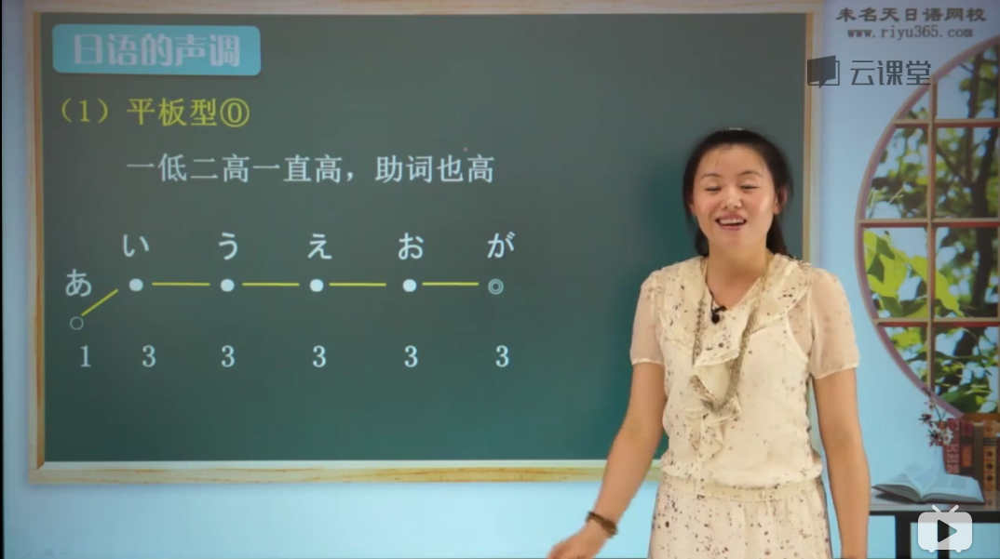
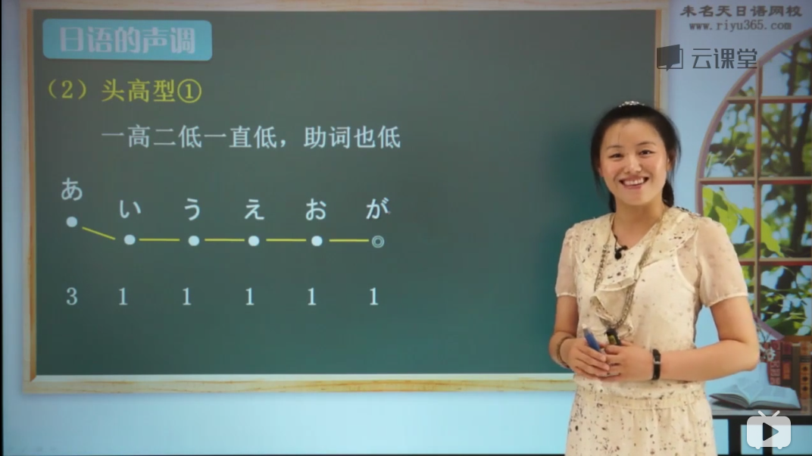
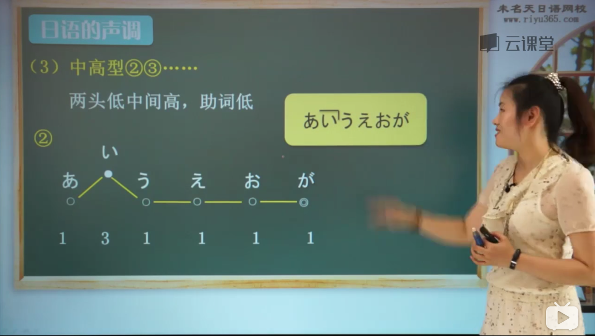
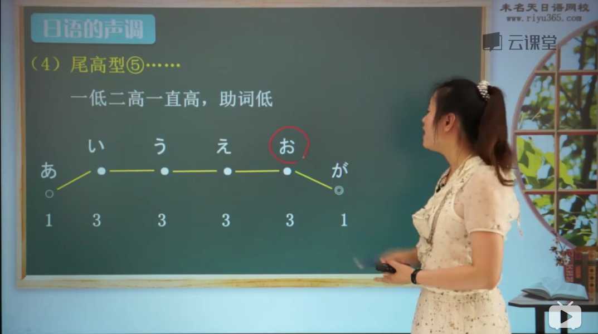
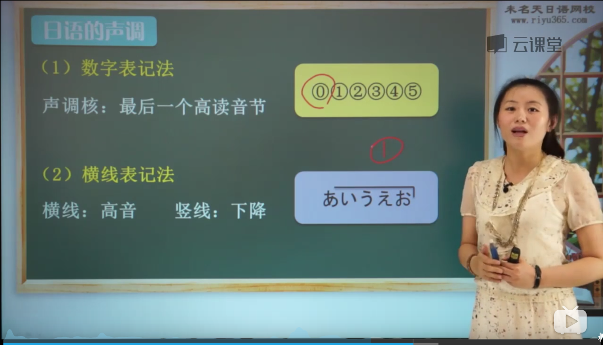

#### 高低型
* 音节（假名）之间高低起伏
* 四大类型：
  * 平板型

  * 头高型
    
  * 中高型
  
  * 尾高型 
  
* 表记方法：
  * 数字表记法
  * 横线表记法

* 两个规则：
  * 单词的第一个音节和第二个音节的高低相反：
    * 第一个音节高，第二个音节低；
    * 反之，第一个音节低，第二个音节高。
  * 一个单词的声调中，要么没有下降，要么只有一处下降。   